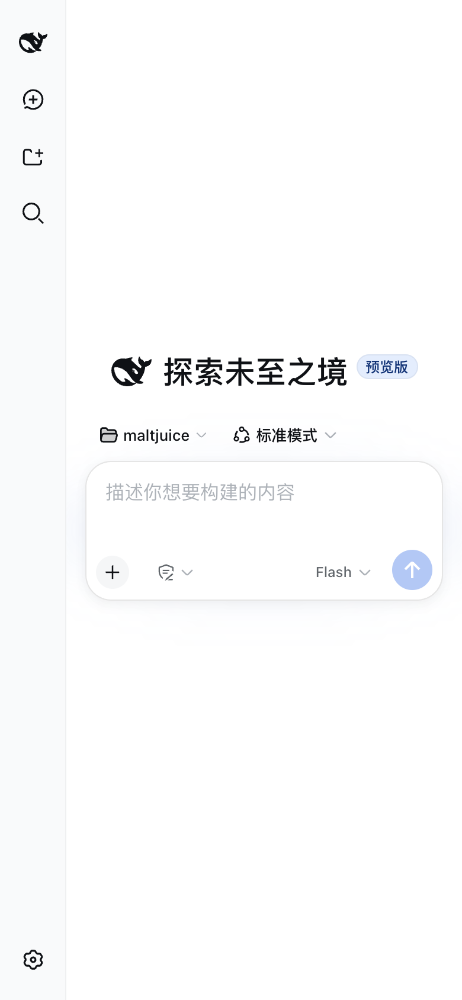
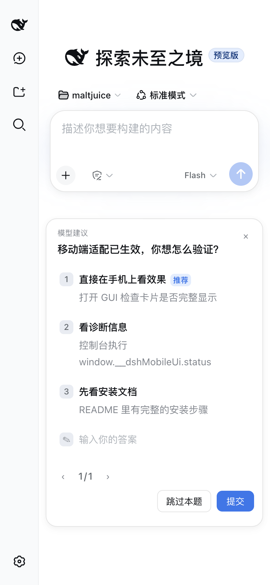

# dsh-mobile-ui

English | [中文](README.zh.md)

Make the [DeepSeek Harness](https://github.com/deepseek-ai/deepseek-harness) Web UI usable on phones. The PC-first interface stops overflowing on mobile viewports: no horizontal scroll, overlay sidebar, full-screen detail panel, bottom-sheet pickers, two-row question/plan-review card footers, safe-area handling — all applied with runtime CSS, zero source changes to DSH itself.





## Features

| Block | What it does |
| --- | --- |
| On-demand trigger | Since v0.3.3 the plugin only runs when the viewport is ≤820px; on wider screens nothing is injected or executed — zero desktop impact even at runtime |
| Overflow containment | Page never scrolls horizontally; long tokens wrap; code blocks / tables scroll inside; images shrink; dialogs never exceed the viewport |
| Sidebar overlay + details full-screen | Expanding the sidebar on a phone overlays the content instead of squeezing the chat column; the details/preview panel becomes a full-screen layer |
| Composer safe area | Input area avoids the iOS bottom safe-area inset; model trigger shortens to Flash/Pro |
| Model picker → bottom sheet | Model selector becomes a thumb-reachable bottom sheet |
| Command popups → bottom sheet | `/model` and similar popupSelect views become bottom sheets |
| Conversation header layout | Two-row header (title + download session on one line, standard mode + background tasks on the next), scrollable tabs, capped composer height |
| Jobs / export compacting | Background-task label truncates; download-session button collapses to a round icon |
| Settings full-screen | Settings page goes full-screen with a top horizontal nav; inputs take the full row width |
| Question card two-row footer | `ask_user_question` cards: footer splits into two rows (pager + error hint on one, action buttons right-aligned on the next) — buttons are never clipped on narrow screens, the card uses the full width, and long option text wraps |
| Plan-review card | Plan-review cards get the same two-row footer; the three buttons wrap instead of overflowing |
| Message meta wraps | The per-message meta line (time · ran-for · first-token · tok/s; hover-revealed on desktop, always shown on mobile) wraps instead of clipping — nothing ever overflows the screen at any width |
| Dialog recentering | Dialogs that render into a 0-width column and become invisible are auto-recentered |
| Overlap self-healing | Runtime detection of real button/control overlaps; the offending flex row is switched to wrapping (`.mui-wrap`) |

## Installation

Requires a DSH web profile (`dsh web`). All changes are browser-side — no DSH source is modified.

### Option 1: one-line installer (macOS / Linux)

```sh
bash -c "$(curl -fsSL https://raw.githubusercontent.com/lan450/dsh-mobile-ui/main/install.sh)"
```

Clones the plugin into the profile's `plugins/` directory, registers it in the
profile `package.json` and `cordis.patch.yml` (idempotent — safe to run again),
and prints the restart hint.

### Option 2: manual (any platform)

```sh
DSH_HOME="${DSH_HOME:-$HOME/.dsh}"          # adjust if your DSH home differs
PROFILE="${PROFILE:-web}"                    # the profile running `dsh web`

# 1. clone the plugin into the profile's plugins dir
git clone --depth 1 https://github.com/lan450/dsh-mobile-ui.git \
  "$DSH_HOME/profiles/$PROFILE/plugins/dsh-mobile-ui"

# 2. register it in the profile package.json and install
cd "$DSH_HOME/profiles/$PROFILE"
pnpm add "dsh-mobile-ui@file:plugins/dsh-mobile-ui"

# 3. append the plugin row to cordis.patch.yml
cat >> cordis.patch.yml <<'EOF'
- insert:
    - id: mobile-ui
      name: 'dsh-mobile-ui'
EOF
```

Then restart `dsh web` (or reload the profile). On the phone, open the Web UI
and refresh — done.

## Usage

Open the Web UI on your phone (the plugin also works in a desktop browser
narrower than 820px). Everything is applied automatically. On screens **wider
than 820px the plugin does not run at all** — no styles injected, no
behavior blocks, no observers or polling; the desktop UI is completely
untouched (model names stay full, no dialog recentering). When the viewport
crosses the breakpoint, the plugin starts/stops itself automatically.

### Diagnostics

In the browser console:

```js
window.__dshMobileUi.status   // per-block state: ok / miss / run / off
window.__dshMobileUi.notes    // why a block missed (stylesheet not ready / entries mismatch)
```

On wide screens `status` is empty — the plugin is off. A derived block that
misses its class names falls back to structural selectors (usable on phones)
or renders no CSS (e.g. `modelSheet`/`popupSheet`), and `notes` explains why.

## Uninstall

Remove the `- insert:` row from `cordis.patch.yml` (and optionally
`dsh-mobile-ui` from the profile `package.json`), then restart `dsh web`. The
plugin adds no persistent state, so nothing else to clean up.

## Development

- `lib/client.js` — the whole plugin (browser half). Edit it and refresh the
  page; it is fetched on every load.
- The installer links `node_modules/dsh-mobile-ui` to `plugins/dsh-mobile-ui`
  (a symlink from `node_modules`: `../plugins/dsh-mobile-ui`) so source edits
  take effect immediately. If you install manually with plain `pnpm add
  file:...`, the package is *copied* — replace the copy with that symlink.
- `package.json` → `dsh.client.inject` — load-order dependencies; changing it
  requires a service restart.
- Everything is on-demand since v0.3.3: the plugin only starts when
  `(max-width: 820px)` matches and fully stops when it does not, so desktop
  is never affected — not even at runtime.
- Hash class names are derived at runtime from the official component
  stylesheets (`style[data-plugin-css="<pkg>/<File>.module.css"]`); when the
  stylesheet is not ready yet, the plugin retries on DOM mutations and a 3s
  poll.

## Compatibility

Tested against DSH web `0.1.0-rc.6` (deepseek-harness master). Works over
plain HTTP (LAN) — a `crypto.randomUUID` fallback is included for non-secure
contexts.

## License

MIT
